#GCP MigrationPro

## GCP Migration Assistant and Analyzer Tool

## Overview
The GCP Migration Assistant and Analyzer Tool is an open-source solution designed to help organizations migrate their existing infrastructure, applications, and data to Google Cloud Platform (GCP). This comprehensive tool simplifies the planning, execution, and optimization of cloud migration processes.

```mermaid
graph TD
    subgraph Planning
        AS[AssessmentService] --> PS[PlanningService]
        PS --> RA[ResourceAllocator]
        PS --> TG[TimelineGenerator]
        PS --> CI[ChallengeIdentifier]
    end

    subgraph Migration
        PS --> CS[ContainerizationService]
        PS --> DTT[DataTransferTool]
        PS --> DMS[DataMigrationService]
        PS --> NC[NetworkConfigurator]
    end

    subgraph Optimization
        OS[OptimizationService] --> MC[MonitoringClient]
        OS --> DC[DashboardsClient]
    end

    subgraph Rollback
        RS[RollbackService] --> SC[StorageClient]
        RS --> CC[ComputeClient]
    end

    subgraph Integration
        KI[KubernetesIntegration]
        CRI[CloudRunIntegration]
    end

    subgraph Security
        SecC[SecurityConfigurator] --> SCC[SecurityCenterClient]
    end

    subgraph Reporting
        RT[ReportingTool]
    end

    subgraph Training
        TM[TrainingModule]
    end

    subgraph CostEstimation
        CE[CostEstimator] --> CompC[ComputeClient]
        CE --> BC[BillingClient]
    end

    subgraph Monitoring
        MMS[MigrationMonitoringService]
    end

    PS --> RT
    PS --> OS
    PS --> RS
    PS --> KI
    PS --> CRI
    PS --> SecC
    PS --> TM
    PS --> CE
    PS --> MMS
```



## Key Features

- **Migration Readiness Assessment**: Evaluates your current IT setup to determine cloud readiness, compatibility issues, estimated costs, and potential migration challenges.
- **Automated Migration Planning**: Creates detailed migration plans with step-by-step instructions, resource allocation, and timelines based on the initial assessment.
- **Data Migration Support**: Offers tools for efficient data transfer and synchronization with GCP services like Cloud Storage and BigQuery.
- **Application Containerization Assistance**: Guides you through containerizing applications for GCP's Kubernetes Engine and Cloud Run.
- **Network and Security Configuration**: Helps configure network settings and security measures in GCP for a secure migration.
- **Integration with GCP Migration Services**: Complements existing GCP migration tools like Migrate for Compute Engine and Database Migration Service.
- **Post-Migration Optimization**: Provides recommendations for cost-saving, performance improvements, and further optimization after migration.
- **Real-Time Monitoring and Reporting**: Monitors the migration process in real-time with detailed reporting capabilities.
- **Rollback Features**: Offers robust rollback options to minimize downtime and data loss in case of migration issues.
- **User Training and Documentation**: Includes comprehensive documentation and training modules for effective tool utilization.

## Impact
This tool aims to reduce the complexity and risks of cloud migration, making it more accessible to a broad range of businesses and ensuring that organizations can fully leverage GCP services post-migration.

## Getting Started

### Prerequisites
Ensure you have Python installed on your system. This tool has been tested with Python 3.8 and above.

### Installation
1. Clone the repository to your local machine.
2. Navigate to the cloned directory.
3. Install the required dependencies by running:
   ```
   pip install -r requirements.txt
   ```

### Usage
To start using the tool, run the following command:
```
python main.py
```
Follow the on-screen prompts to begin the migration assessment and planning process.

## File Structure
- `requirements.txt`: Lists the Python package dependencies.
- `README.md`: This file, containing an overview and usage instructions.
- `setup.py`: Setup script for installing the tool.
- `assessment_service.py`: Service for assessing migration readiness.
- `compatibility_checker.py`: Checks compatibility of current infrastructure with GCP.
- `cost_estimator.py`: Estimates the cost of migration.
- `challenge_identifier.py`: Identifies potential challenges in migration.
- `planning_service.py`: Generates detailed migration plans.
- `resource_allocator.py`: Handles allocation of resources for migration.
- `timeline_generator.py`: Creates timelines for migration execution.
- `data_migration_service.py`: Supports data migration processes.
- `data_transfer_tool.py`: Tool for data transfer to GCP.
- `data_sync_tool.py`: Tool for data synchronization with GCP.
- `containerization_service.py`: Assists in containerizing applications.
- `kubernetes_integration.py`: Integrates with GCP's Kubernetes Engine.
- `cloud_run_integration.py`: Integrates with GCP's Cloud Run.
- `network_configurator.py`: Configures network settings for GCP.
- `security_configurator.py`: Configures security measures for GCP.
- `gcp_migration_integration.py`: Integrates with GCP migration services.
- `optimization_service.py`: Service for post-migration optimization.
- `monitoring_service.py`: Monitors the migration process.
- `reporting_tool.py`: Generates reports on the migration process.
- `rollback_service.py`: Provides rollback features in case of migration failure.
- `training_module.py`: Contains user training materials.
- `main.py`: The main script to run the tool.
- `documentation.md`: Detailed documentation of the tool.

## Contributing
We welcome contributions to this project! Please refer to `CONTRIBUTING.md` for guidelines on how to make a contribution.

## License
This project is licensed under the terms of the MIT license. See the `LICENSE` file for details.

## Support
For support and queries, please open an issue in the project's GitHub issue tracker.

## Acknowledgments
This project is made possible by the contributions of the open-source community and the use of Google Cloud Platform services.

